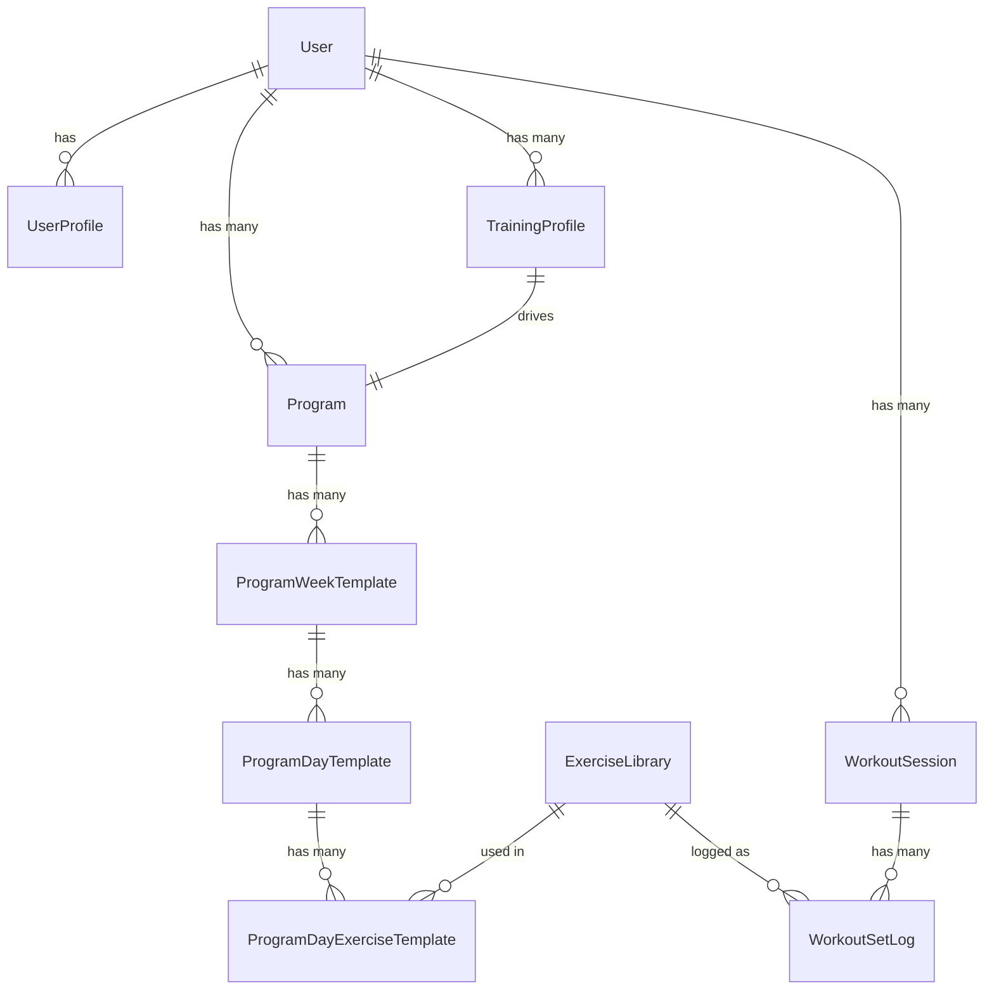

# ER Diagram – FitMind Strength (MVP1)

```mermaid
erDiagram
  User ||--o{ UserProfile : has
  User ||--o{ TrainingProfile : "has many"
  User ||--o{ Program : "has many"
  User ||--o{ WorkoutSession : "has many"

  TrainingProfile ||--|| Program : "drives"

  Program ||--o{ ProgramWeekTemplate : "has many"
  ProgramWeekTemplate ||--o{ ProgramDayTemplate : "has many"
  ProgramDayTemplate ||--o{ ProgramDayExerciseTemplate : "has many"

  ExerciseLibrary ||--o{ ProgramDayExerciseTemplate : "used in"
  ExerciseLibrary ||--o{ WorkoutSetLog : "logged as"

  WorkoutSession ||--o{ WorkoutSetLog : "has many"
```
